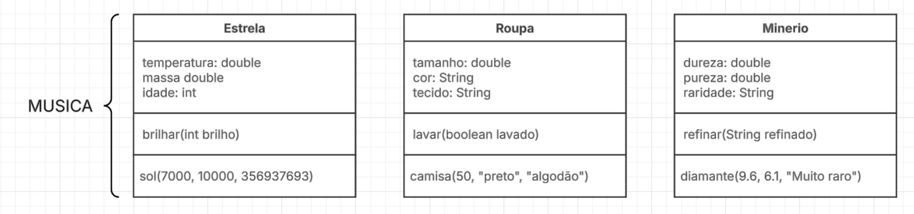
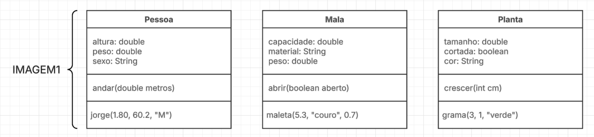
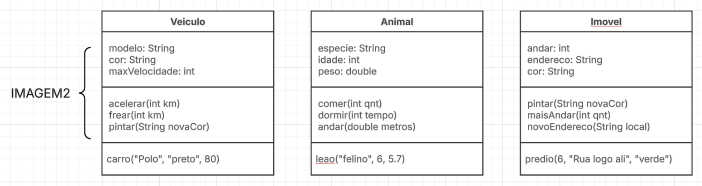
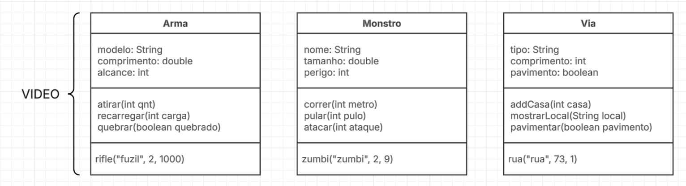

# Linguagem de Programação I
## Atividades criação UML
Música - [https://youtu.be/5EpyN_6dqyk?si=2SDab4f7eYbWgrQU](https://youtu.be/5EpyN_6dqyk?si=2SDab4f7eYbWgrQU)   

Imagem1 - [https://youtu.be/5EpyN_6dqyk?si=2SDab4f7eYbWgrQU](https://cdn.culturagenial.com/imagens/track-brawl-cke.jpg?class=article)   

Imagem2 - [https://www.mauromartins.com/agency-tour](https://www.mauromartins.com/agency-tour)   

Video - [https://www.youtube.com/watch?v=FKtaOY9lMvM](https://www.youtube.com/watch?v=FKtaOY9lMvM)   

